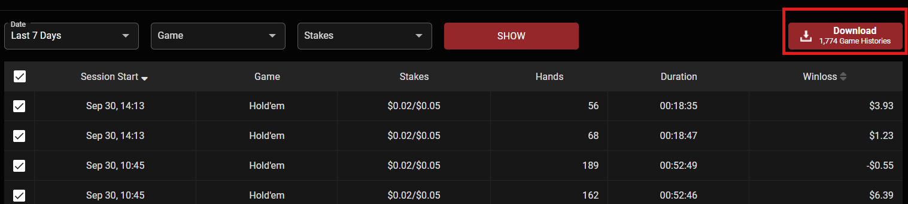

# **GGPoker Hand Analyzer**

<div align="center">


</div>

**A completely free, privacy-focused, and lightweight web-based tool for analyzing your GGPoker hands anytime, anywhere.**

<p align="center">  
<strong>English</strong> •  
<a href="./README.md"><strong>繁體中文 (Traditional Chinese)</strong></a>  
</p>

## **✨ LIVE DEMO** 
**Collect your data files from Pokercraft**

Download *"Game summaries"* file by your pokercraft cash game section,
and *"Hand histories"* file by pressing red button on your pokercraft section.
If there are too many hands records on your account, GGNetwork will prevent you from bulk downloading,
therefore you may have to download separately monthly or weekly records.




**Try it now 👉 [ggpokerAnalyzer](https://layorx.github.io/ggpokerAnalyzer/index.html)**


## **🚀 Features**

* **📈 Comprehensive Stats**: Calculates over 40 key poker metrics (VPIP, PFR, 3-Bet, C-Bet, etc.).  
* **📊 Data Visualization**: Presents profit graphs, positional data, and win rates by time in intuitive charts.  
* **💡 Smart Recommendations**: Provides personalized suggestions based on your stats to help you identify and plug leaks.  
* **🔐 Privacy First**: All hand history data is **processed locally in your browser**. Nothing is ever uploaded to a server, ensuring your data remains private.  
* **🌐 Multi-language Support**: Available in Traditional Chinese and English.  
* **💾 Data Integration**: Supports uploading .txt hand history files and can merge old .json analysis reports for long-term tracking.

## **💡 Philosophy**

Unlike professional tracking software like PokerTracker or Hold'em Manager, which require complex setups and subscriptions, this tool aims to be a **lightweight, fast, free, and secure** alternative. We focus on the **web experience**, so you don't need to install anything. Just open your browser—on your desktop or mobile device—to quickly review your sessions anytime, anywhere, and find your edge.

## **🧐 Strengths & Challenges**

### **✅ Strengths**

* **Completely Free & Open-Source**: No costs involved. The code is transparent and trustworthy.  
* **High Privacy Protection**: All computations are done locally on your device. Hand data never touches a server, eliminating the risk of data leaks.  
* **Cross-Platform & No Installation**: Works in any modern browser, making it accessible on any device.  
* **Data Portability & Accumulation**: Analysis results can be exported as a JSON file for personal backup and can be re-imported to merge with new sessions for long-term tracking.  
* **Intuitive Visualization**: Charts and graphs make it easier to understand your performance trends than reading raw text files.

### **⚠️ Challenges**

* **No Real-time HUD**: Unlike professional software, it cannot display opponent stats on the table in real-time.  
* **Manual Upload Required**: You need to manually export hand histories from the GGPoker client and upload them.  
* **Basic Metrics**: While covering core stats, the level of detail is less granular than professional tools (e.g., no profit analysis by specific holdings).  
* **Frontend Performance Bottleneck**: With hundreds of thousands of hands, client-side JavaScript calculation might slow down or cause the browser to lag.  
* **No Opponent Analysis**: The tool is entirely focused on "Hero's" data and does not build a database for analyzing specific opponents.

## **🗺️ Future Roadmap**

We have a grand vision for this tool and, with the community's help, we plan to implement the following features:

1. **\[Cloud Backend Integration\]**: Move computation-heavy tasks to a backend service to resolve frontend performance issues.  
2. **\[User Accounts & Data Sync\]**: Introduce user accounts to automatically save analysis results to the cloud, enabling cross-device data synchronization.  
3. **\[Visual Hand Replayer\]**: Add a feature to replay a selected hand graphically from start to finish.  
4. **\[Advanced Data Filters\]**: Allow users to filter data by position, starting hands, pot size, and more for deeper analysis.  
5. **\[Starting Hand Matrix Heatmap\]**: Display VPIP, PFR, and profit data for all starting hands on a 13x13 grid.  
6. **\[Specific Game/Stake Analysis\]**: Add filters for specific stake levels or game types (e.g., Rush & Cash).  
7. **\[More Chart Types\]**: Introduce pie charts (e.g., action distribution by position) and radar charts (for a holistic view of a player's style).  
8. **\[Simple Opponent Tagging\]**: While not a full HUD, allow users to add tags (e.g., Fish, TAG) to opponent IDs during review.  
9. **\[Goal-Oriented Learning Modules\]**: Recommend relevant poker learning resources based on identified statistical weaknesses.  
10. **\[Shareable Reports\]**: Generate a shareable, read-only link to a report page (excluding sensitive details) for discussions with coaches or friends.

## **🛠️ Tech Stack**

* **Vite**: High-performance frontend tooling.  
* **Vanilla JavaScript (ESM)**: No frameworks, just core logic.  
* **Tailwind CSS**: For rapidly building a modern UI.  
* **Chart.js**: For data visualization.

## **📁 Project Structure**
```
/  
├── index.html              \# Main HTML file  
├── package.json            \# Project dependencies and scripts  
├── vite.config.js          \# Vite config file  
├── demo_data/
│   ├── lite_data/          \# Hand history data for lightweight testing (approx. 100 hands)
│   └── 10000_data/         \# Hand history data for 10,000 hands
└── src/  
    ├── main.js             \# App entry point  
    ├── style.css           \# CSS styles  
    ├── utils.js            \# Shared utility functions  
    ├── lib/  
    │   ├── parser.js       \# Hand history parsing logic  
    │   └── stats.js        \# Stats calculation and merging logic  
    └── ui/  
        ├── dashboard.js    \# UI rendering logic for the dashboard  
        └── lang.js         \# Multi-language translations and management
```
## **💻 Installation & Local Setup**

**Prerequisites:**

* [Node.js](https://nodejs.org/) (v18.x or higher is recommended)  
* npm / pnpm / yarn

**Steps:**

1. **Clone the repository**  
```
   git clone https://github.com/Layorx/GGPoker-Hand-Analyzer.git 
   cd GGPoker-Hand-Analyzer
```
2. **Install dependencies**  
   `npm install`

3. **Start the development server**  
   `npm run dev`

   The application will be running at http://localhost:5173 (or another available port).  
4. **Build for production**  
   `npm run build`

   The production-ready files will be in the dist folder.

## **💖 Contributing**

This is an open-source project, and contributions of all kinds are welcome\! **Whether you are an experienced developer or a newcomer, your help is appreciated in making this tool even better\!**

**How to contribute:**

1. Found a bug or have an idea?  
   Please open an issue on the GitHub Issues page. Describe it in as much detail as possible.  
2. **Want to contribute code?**  
   * **Fork** this repository.  
   * Create a new branch (`git checkout \-b feature/AmazingFeature`).  
   * Make your changes and commit them (`git commit \-m 'Add some AmazingFeature'`).  
   * Push to your branch (`git push origin feature/AmazingFeature`).  
   * Open a **Pull Request** with a clear description of your changes.

We will review your contribution as soon as possible. Thank you to everyone who dedicates their time and effort to this project\!

## **📄 License**

This project is licensed under the [MIT License](https://www.google.com/search?q=./LICENSE).